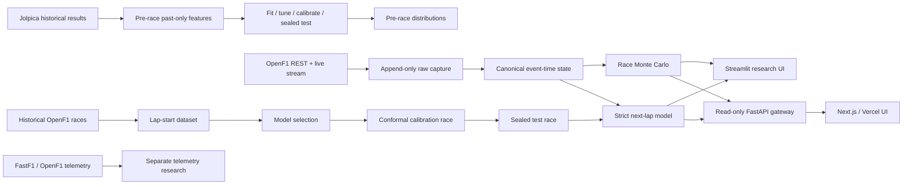

# F1 Race Intelligence

A reproducible Formula 1 research platform for pre-race ranking, live public-data capture, next-lap forecasting, telemetry exploration and transparent race-strategy simulation.

The project is deliberately evidence-first: a newer or larger model is only promoted when it beats simple baselines on chronological held-out races. Historical source limitations, simulated latency and public-vs-team telemetry gaps are kept visible instead of being hidden behind a dashboard.

## What is implemented

- **Pre-race probability forecasting** with chronological whole-race evaluation and coherent Plackett–Luce outcome distributions.
- **Direct Plackett–Luce ranking challenger** instead of only converting regression scores after training.
- **Modern tabular challengers**: HistGradientBoosting, ExtraTrees and optional XGBoost, LightGBM, CatBoost and local TabICLv2.
- **Sealed benchmark v2**: old races fit → later races tune → later races calibrate → final races test.
- **OpenF1 live state**: REST bootstrap plus optional authenticated MQTT streaming, append-only raw JSONL capture and atomic state snapshots.
- **Next-lap intelligence** with lap-start cutoffs, explicit label availability, weather/race-control as-of joins and whole-race validation.
- **Regime-aware pace model**: green / neutralized / pit classification plus green-lap regression and split-conformal intervals.
- **Leakage-strict next-lap model** that excludes historical compound, tyre-age and stint-number joins because historical stint publication timestamps are unavailable.
- **Transparent Monte Carlo strategy simulator** for live finishing distributions and pit-window counterfactuals.
- **Empirical simulator priors** for pit loss, Safety Car frequency and pooled DNF hazard from captured historical public data.
- **Read-only FastAPI gateway** that exposes live state, telemetry, race simulation and strategy scenarios without sending provider/model credentials to the browser.
- **Vercel-ready Next.js live UI** plus Streamlit research/debug views for race probabilities, approximate track position, public telemetry, strategy and next-lap pace.

## Data reality

OpenF1 provides free historical data from 2023 onward. Real-time access is a separate authenticated subscription. Public `car_data` is roughly 3.7 Hz and includes speed, throttle, brake state, gear, RPM and DRS; it is not the full team sensor feed.

The project never treats unavailable fuel load, setup, internal tyre temperature or private engineering channels as observed data. Historical OpenF1 `stints` are useful for retrospective research, but because their historical REST rows do not expose an as-published timestamp, compound / tyre age / stint number are excluded from the evidence-grade strict next-lap benchmark.

Sources: [OpenF1 docs](https://openf1.org/docs/), [FastF1](https://github.com/theOehrly/Fast-F1), [Jolpica](https://github.com/jolpica/jolpica-f1).

## Install

Python 3.12 is the tested environment.

```bash
python -m venv .venv
# Windows: .venv\Scripts\activate
# macOS/Linux: source .venv/bin/activate
python -m pip install -r requirements-lock.txt
python -m pip install -e . --no-deps
```

Optional capabilities:

```bash
pip install -e '.[app]'         # Streamlit + Altair
pip install -e '.[live]'        # OpenF1 MQTT client
pip install -e '.[api]'         # FastAPI + Uvicorn live gateway
pip install -e '.[modern]'      # XGBoost / LightGBM / CatBoost
pip install -e '.[foundation]'  # local TabICLv2 challenger
pip install -e '.[telemetry]'   # FastF1 / matplotlib
```

## 1. Offline software demo

```bash
python -m f1_research demo --output reports/demo
python -m streamlit run app/dashboard.py
```

The bundled demo is synthetic and labelled as such. It validates software behavior, not real racing skill.

## 2. Historical pre-race benchmark

```bash
python -m f1_research collect \
  --years 2022 2023 2024 2025 \
  --output data/results.csv \
  --cache data/raw

python -m f1_research benchmark-v2 \
  --input data/results.csv \
  --output reports/local/benchmark-v2 \
  --test-events 12 \
  --tuning-events 6 \
  --calibration-events 4 \
  --min-fit-events 20 \
  --models hist_gradient_boosting extra_trees
```

Optional modern challengers can be added to `--models`:

```text
xgboost lightgbm catboost tabicl_v2
```

The sealed test block is not used for model choice, hyperparameter selection or probability-temperature calibration.

### Previously measured expanding-window evidence

The earlier 2022–2025 study used 92 races and 70 chronological held-out events after warm-up.

| Model | Winner log loss ↓ | Brier sum ↓ | Position MAE ↓ | Winner first choice ↑ |
|---|---:|---:|---:|---:|
| Qualifying order | 1.6654 | 0.6744 | 3.2767 | 61.43% |
| Recent form | 1.9303 | 0.6695 | 3.9956 | 45.71% |
| Ridge rank | 1.4150 | 0.5930 | 3.3189 | 51.43% |
| Gradient boosting | 1.5926 | 0.6340 | 3.2816 | 50.00% |

That result is retained as historical evidence only. The newer challenger stack must earn its place through `benchmark-v2`; benchmark reputation is not substituted for F1-specific evidence.

## 3. Capture live OpenF1 state

Historical REST bootstrap only:

```bash
f1-live capture --output reports/local/live --session-key latest --no-stream
```

Authenticated live stream:

```bash
export OPENF1_USERNAME='...'
export OPENF1_PASSWORD='...'
f1-live capture --output reports/local/live --session-key latest
```

You can also provide `OPENF1_TOKEN` directly.

The capture writes:

```text
reports/local/live/
  events.jsonl    # immutable raw messages with receipt times
  state.json      # current canonical state, atomically replaced
  manifest.json   # hashes and capture metadata
```

A saved capture can be reconstructed without network access:

```bash
python -m f1_research.openf1_live replay \
  --input reports/local/live/events.jsonl \
  --output reports/local/replayed-live
```

## 4. Train next-lap models

### Evidence-grade strict model

```bash
f1-laps-strict \
  --year 2026 \
  --race-count 8 \
  --output reports/local/lap-strict
```

To let local TabICLv2 compete under the same chronological protocol:

```bash
f1-laps-strict --year 2026 --race-count 8 --foundation
```

The strict model uses only features supported at the forecast cutoff by the historical contract. Historical `compound`, `tyre_age` and `stint_number` are deliberately excluded from model inputs.

### Rich exploratory model

```bash
f1-laps \
  --year 2026 \
  --race-count 8 \
  --output reports/local/lap-intelligence
```

This pipeline also retains retrospective stint features for ablation/research and therefore must not be presented as stronger live-timing evidence than the strict model.

Both pipelines keep whole races separated for model selection, conformal calibration and final testing. Simple `recent_median` and `last_lap` baselines remain visible.

## 5. Live web app and research dashboards

The production-oriented path is deliberately split: keep OpenF1 capture, model artifacts and Monte Carlo on a persistent Python worker; deploy only the stateless Next.js frontend to Vercel.

Start the read-only worker gateway beside the capture process:

```bash
export F1_API_TOKEN='replace-with-a-long-random-secret'
export F1_LIVE_STATE_PATH="$PWD/reports/local/live/state.json"
export F1_LIVE_EVENTS_PATH="$PWD/reports/local/live/events.jsonl"
export F1_STRICT_MODEL_PATH="$PWD/reports/local/lap-strict/next_lap_strict.joblib"
export F1_STRATEGY_PRIORS_PATH="$PWD/reports/local/lap-strict/strategy_priors.json"
f1-api
```

The gateway exposes `/healthz`, `/v1/live`, `/v1/telemetry` and `/v1/strategy`. If the strict artifact is unavailable, the API reports `fallback_recent_laps` instead of inventing an AI prediction.

Run the Vercel-ready frontend locally:

```bash
cd web
npm install
export F1_BACKEND_URL='http://127.0.0.1:8000'
export F1_BACKEND_TOKEN='replace-with-a-long-random-secret'
npm run dev
```

For Vercel, import this repository with **Root Directory = `web`**, use Node 22.x, and set `F1_BACKEND_URL` plus `F1_BACKEND_TOKEN` as server-side environment variables. Do not use a `NEXT_PUBLIC_` token. See [Vercel deployment](docs/VERCEL_DEPLOYMENT.md).

The Next.js screen combines live race distribution, strict next-lap pace, public telemetry and pit-window scenarios from one canonical race state. It marks stale data instead of presenting an old state as live.

The Streamlit views remain useful for local research/debugging:

```bash
python -m streamlit run app/race_intelligence_dashboard.py
python -m streamlit run app/live_dashboard.py
python -m streamlit run app/strict_pace_dashboard.py
python -m streamlit run app/pace_dashboard.py
```

## 6. Strategy simulation from a captured state

Full remaining-race Monte Carlo:

```bash
python -m f1_research live-predict \
  --state reports/local/live/state.json \
  --total-laps 57 \
  --samples 20000 \
  --output reports/local/live-prediction.json
```

Pit-window counterfactuals for one driver:

```bash
python -m f1_research pit-window \
  --state reports/local/live/state.json \
  --total-laps 57 \
  --driver-number 1 \
  --samples 20000 \
  --output reports/local/pit-window.json
```

The simulator produces coherent finishing-order distributions. It is not represented as team software: public-data pace, pit-loss priors, Safety Car uncertainty and pooled reliability priors remain explicit assumptions or calibrated public-data quantities.

## Architecture



## Model policy

`sklearn.GradientBoostingRegressor` is no longer treated as the modern default. Current challengers include histogram boosting, ExtraTrees, tuned gradient-boosting libraries and TabICLv2. Tree ensembles remain important because F1 data is tabular, heterogeneous and relatively small by deep-learning standards.

A foundation model is not automatically better. The selection rule is empirical:

1. freeze chronological blocks,
2. tune using past races only,
3. calibrate on a later disjoint race/block,
4. score a sealed future race/block,
5. compare against simple baselines,
6. only promote the challenger if the requested metric actually improves.

TabICLv2 is the preferred local pretrained challenger because it is sklearn-compatible and openly available. Other foundation models may have non-commercial weight licenses; they are not silently introduced into a deployable default stack.

## Event-time rules

- A lap duration cannot become a feature until the lap is complete plus the explicit simulated latency.
- Future result mutations are tested not to alter earlier features or forecasts.
- Weather and race-control observations are joined backward/as-of to the forecast cutoff.
- Out-of-order live messages cannot overwrite newer driver/topic state.
- Live raw messages are retained so a displayed forecast can be replayed from its source stream.
- Historical stint metadata without publication timestamps is marked retrospective and excluded from the strict next-lap model.

## Telemetry caveats

- OpenF1 brake is a state (`0`/`100`), not brake pressure.
- Speed-integrated distance is not precision GPS.
- Approximate x/y location is useful for a track view, not racing-line reconstruction.
- Public telemetry does not expose the complete team sensor set.
- A pace slope is not automatically isolated tyre degradation; fuel burn, traffic, track evolution and race state also move lap time.

## Tests and CI

```bash
python -m ruff check .
python -m pytest -q
python -m f1_research demo --output reports/ci-demo

cd web
npm install
npm run typecheck
npm run build
```

Tests cover future-label mutation, event-time cutoffs, simultaneous events, model parity, probability coherence, out-of-order live messages, strategy simulation determinism, conformal intervals, strict rejection of retrospective stint-feature leakage, API authentication/fallback behavior and telemetry-tail filtering.

Normal CI is offline. `Research checks` validates the Python stack and `Web checks` validates the Next.js production build. `.github/workflows/openf1-smoke.yml` is a manual network smoke test that downloads one completed OpenF1 race, records source hashes and verifies that the event-time dataset can still be built against the current API.

## Status

This branch is research software under active development. The strongest claims should come from generated benchmark reports, not from architecture sophistication. Live OpenF1 connectivity also depends on provider entitlement and cannot be proven by an offline unit test.


## Production evidence path

The repository now separates software demos from evidence-bearing releases.

```bash
# 1. Build a real historical dataset.
f1-research collect --years 2018 2019 2020 2021 2022 2023 2024 2025 2026 \
  --output reports/history.csv

# 2. Build a sealed chronological benchmark and content-addressed model release.
f1-release --input reports/history.csv --output reports/release \
  --test-events 12 --tuning-events 8 --calibration-events 6 --min-fit-events 30 \
  --modern-models hist_gradient_boosting,extra_trees,xgboost,lightgbm,catboost

# 3. Run the real-provider data-truth workflow from GitHub Actions.
#    It audits 12 completed races across OpenF1, Jolpica and FastF1.

# 4. Fail closed before deployment.
f1-production-check \
  --data-truth reports/data-truth/data_truth_matrix.json \
  --benchmark reports/release/benchmark/report.json \
  --manifest reports/release/model_manifest.json \
  --model reports/release/model.joblib
```

The production gate requires at least 12 persisted real-provider audit artifacts, no
`FAIL` data-truth event, a disjoint fit/tuning/calibration/sealed-test benchmark,
and a model whose SHA-256 and benchmark run id match its manifest.

### Live architecture

`f1-live` performs REST bootstrap and authenticated OpenF1 MQTT capture. Raw events
are appended to `events.jsonl`; `RaceStateStore` publishes an atomic canonical
state. `f1-api` exposes health, live race simulation, strategy counterfactuals,
telemetry, captured location trails, model evidence and a versioned WebSocket state
stream. The Next.js UI renders leaderboard probabilities, pace, telemetry, strategy
and an approximate circuit trace reconstructed from captured public x/y samples.

Historical OpenF1 gaps remain explicit unknown evidence. Provider disagreements are
never repaired by majority vote, and missing values are never silently converted to
zero/false.
