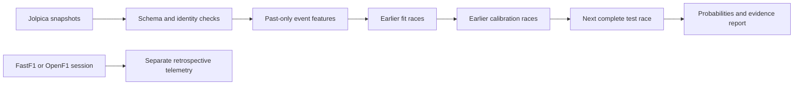

# F1 Race Research

Reproducible post-qualifying race forecasts, chronological model comparison, and retrospective telemetry analysis.

The project asks whether historical driver/team form adds information beyond qualifying order. It evaluates complete future races, reports probability quality and keeps race telemetry separate from pre-race features.

## Offline demo

Python 3.12 is the tested environment. From the repository root:

```bash
python -m venv .venv
# Windows: .venv\Scripts\activate
# macOS/Linux: source .venv/bin/activate
python -m pip install -r requirements-lock.txt
python -m pip install -e . --no-deps
python -m f1_research demo
python -m streamlit run app/dashboard.py
```

The bundled demo is **synthetic** and labeled throughout. It demonstrates software behavior, not racing prediction skill. The Turkish dashboard includes forecasts, comparisons, calibration, data provenance and a separate telemetry explorer.

## Real historical benchmark

Collected **1,838 driver-result rows from 92 races in 2022–2025**. After 22 warm-up races, **70 races are held out chronologically**, one complete race at a time. Each fold reserves four preceding races for temperature selection and fits on older races. Baselines use the same information cutoff and calibration block.

| Model | Winner log loss ↓ | Brier sum ↓ | Position MAE ↓ | Winner first choice ↑ |
|---|---:|---:|---:|---:|
| Qualifying order | 1.6654 | 0.6744 | 3.2767 | 61.43% |
| Recent form | 1.9303 | 0.6695 | 3.9956 | 45.71% |
| Ridge rank | 1.4150 | 0.5930 | 3.3189 | 51.43% |
| Gradient boosting | 1.5926 | 0.6340 | 3.2816 | 50.00% |
| Uniform probability | 2.9943 | 0.9499 | — | — |

Ridge has lower probability error in this development study; qualifying order chooses the winner more often and has slightly lower rank error. **No model wins every metric.** This is retrospective evidence, not a sealed final-season test or a prospective guarantee. See [benchmark evidence](reports/benchmark/REPORT.md) and [model card](docs/MODEL_CARD.md).

```bash
python -m f1_research collect --years 2022 2023 2024 2025 --output data/results.csv --cache data/raw
python -m f1_research backtest --input data/results.csv --output reports/local/historical-2022-2025 --min-history 22
# Replay cached collection without network calls:
python -m f1_research collect --years 2022 2023 2024 2025 --output data/results.csv --cache data/raw --offline
```

Choose the generated report in the dashboard. Cache entries retain URL, retrieval UTC and checksum. Collection errors fail visibly instead of generating imaginary grids.

## Modeling and evaluation



- Historical statistics update after the whole event, preventing teammate leakage.
- Qualifying gaps consistently use Q1. Target-race weather and final grid penalties are not forecast inputs.
- Train-only preprocessing supports missing qualifying data and unseen teams/circuits.
- Uniform, qualifying and form baselines compete with regularized Ridge and shallow boosting.
- Rank-regression scores parameterize a Plackett–Luce distribution; this is **not** maximum-likelihood PL training. Winner probabilities sum to one; valid sampled permutations yield podium/top-10 marginals.
- Temperature selection uses preceding calibration races only. This procedure is not proof of perfect reliability.
- Reports include per-race predictions, proper scores, reliability bins, paired baseline differences, source/runtime hashes and limitations.

Inference requires an actual dated entry list; see the [data contract](docs/DATA_CONTRACT.md):

```bash
python -m f1_research predict --input data/results.csv --entries data/entries.csv --output reports/local/prediction.json
```

## Real telemetry, separate from forecasting

```bash
# 2024 Bahrain qualifying, selected driver numbers
python -m f1_research.telemetry --provider openf1 --session-key 9468 --driver-numbers 1 16 55 --output reports/local/telemetry
# Alternative when FastF1's upstream archive is available:
python -m f1_research.telemetry --year 2024 --round 1 --session Q --drivers VER LEC --output reports/local/telemetry
```

The OpenF1 example produced two usable traces; a third was rejected for duplicate timestamps or a dropout over one second. FastF1's upstream timing/car request failed during the live check, so provider selection is explicit.

Distance integrates sampled speed; it is not precise GPS. Brake is boolean, not pressure. OpenF1 timed-lap selection does not establish deleted-lap, pit-in or track-status validity. Pace slopes are not isolated tyre degradation measurements.

## Engineering

```bash
python -m pytest -q
python -m ruff check .
```

Tests cover future-label mutation, teammate ordering, simultaneous events, train/inference parity, unseen entrants, probability constraints, pagination, cache integrity, telemetry gaps and offline UI interactions. CI does not depend on live APIs.

`src/f1_research/` separates data, features, models, evaluation, demo and telemetry. `app/` reads saved artifacts without training or downloading. `f1_predictor.py` is a compatibility entry point to the explicit CLI. Flawed original code remains in Git history.

Sources: [Jolpica](https://github.com/jolpica/jolpica-f1/blob/main/docs/README.md), [FastF1](https://github.com/theOehrly/Fast-F1), [OpenF1](https://openf1.org/docs/). OpenF1 historical access from 2023 is free; live access is separate. Raw caches are not committed; data access and software licensing are distinct.

Read the [full code audit](docs/F1_CODE_AUDIT.md) and [research plan](docs/F1_MODEL_PLAN.md). Next stages: archived entry/grid snapshots, practice-pace ablations, retirement models and a newly frozen evaluation period. Strategy simulation is planned, not implemented.

## Lap-by-lap historical replay

```bash
python -m f1_research.live_replay --output reports/local/replay
```

The dashboard displays this run separately under **Tempo ve veri**, with per-driver actual versus forecast lap times, baseline comparisons and tuning evidence. This predicts the next lap duration, not the final race winner. Historical replay does not verify a live ingestion connection.

Four earlier 2024 races train the online Ridge model; China selects the regularization strength; Miami evaluates fixed hyperparameters while newly completed laps update model coefficients. OpenF1 historical data is free, but live access is paid. See [replay protocol](docs/LIVE_REPLAY.md) and [measured replay results](reports/replay-benchmark/REPORT.md).

Latest completed race in the requested year (future sessions excluded):

```bash
python -m f1_research.live_replay --year 2026 --race-count 6 --latest-completed --output reports/local/replay-latest
```

See [latest replay evidence](reports/replay-latest-benchmark/REPORT.md). Model parameters are selected before the final test race; later test-race labels can update coefficients only after their simulated availability time.
