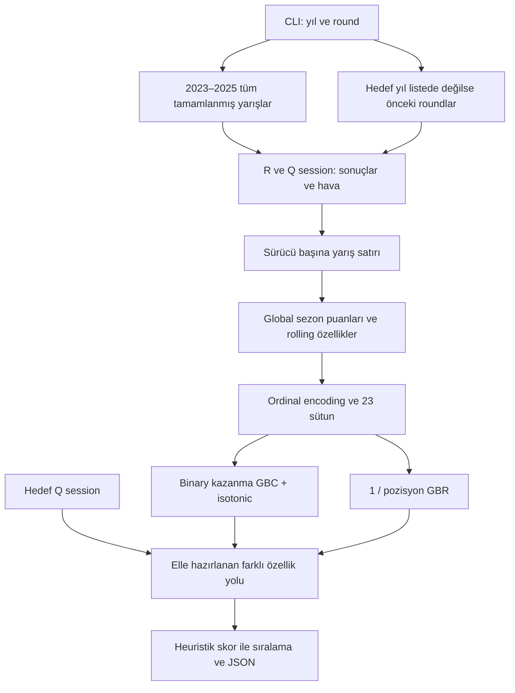

# F1: mevcut kodun tamamının teknik incelemesi

İnceleme tarihi: 15 Eylül 2026. Kaynak: `origin/main`, commit `aad1758f22faf5f5202fa50fbbacf394a41516e3`. Aşağıdaki satırlar bu commit içindeki dosyaya aittir. İnceleme öncesinde yazılmaya başlanan ve şimdi `race-modeling-review/drafts/f1/` altında ayrı tutulan taslak bu mevcut durum incelemesine dahil değildir. Bu rapor statik kod incelemesidir; eğitim veya gerçek yarış backtest sonucu üretilmemiştir.

## Sonuç

Proje anlaşılır bir başlangıç prototipi; ancak mevcut çıktı güvenilir geçmişe dönük başarı veya kalibre edilmiş yarış olasılığı olarak sunulamaz. Sorun ağaç sayısının azlığı değil: tahmin anında bilinmeyen sonuçların özelliklere girmesi, değerlendirme düzeni ve eğitim/tahmin tutarsızlığı. Önce bunlar giderilmeli; daha gelişmiş model aynı sorunların üstüne kurulursa yalnızca daha ikna edici görünen yanlış sonuç üretir.

## Tam kapsam envanteri

Git ağacındaki dört dosyanın tamamı okundu. Başka uygulama kodu, notebook, test, CI veya arayüz bu commit'te yok.

| Dosya / satırlar | Okunan kapsam ve değerlendirme |
|---|---|
| `f1_predictor.py:1–72` | Kullanım metni, importlar, cache yan etkisi, sabit sezon/grid, takım ad eşlemeleri |
| `f1_predictor.py:75–141` | Model durumu, üç encoder, session yükleme, hava ve sıralama süresi yardımcıları, tamamlanan yarış seçimi |
| `f1_predictor.py:146–241` | Tüm veri toplama, puan hesaplama, yarış/sıralama join, sonuç etiketleri |
| `f1_predictor.py:246–329` | 23 özellik, geçmiş özetler, imputasyon ve encoding |
| `f1_predictor.py:334–390` | İki boosting modeli, ağırlıklar, CV, calibration, eğitim MAE |
| `f1_predictor.py:395–518` | Tahmin özelliklerinin elle yeniden kurulması, skor, tablo, JSON |
| `f1_predictor.py:520–545` | Sabit kadrodan fallback çıktısı |
| `f1_predictor.py:551–594` | CLI, takvim, toplama/eğitim/tahmin orchestration |
| `README.md` | Kurulum, özellikler, model, sabit grid ve değerlendirme kapsamı uyarısı |
| `requirements.txt` | Dört bağımlılık; yalnız alt sürüm sınırı var |
| `.gitignore` | Cache, Python artıkları, tüm CSV/JSON dosyaları |

## Mevcut veri ve model akışı

Telemetri veya stint modellemesi yapılmıyor. `s.load()` geniş session verisi yükleyebilir; ancak kullanılan girdiler sonuç tablosu, sıralama süreleri ve ortalama hava. README'de pit stop kaynak kapsamı anılsa da pit stop özelliği yok.

## Öncelikli bulgular

### P0 — Performans iddiasını geçersiz kılan sorunlar

1. **Geçmiş yarış kendisi ve geleceğiyle eğitiliyor.** `154–165` sabit eğitim yıllarının tamamını alır; `168–178` tarih kesimini yalnız liste dışındaki hedef yıla uygular. `--year 2025 --round 12` için 2025 R12 ve sonrası, hatta 2023 hedefi için 2024–2025 eğitimde olabilir. Hedef yarış kimliği ve tahmin anı bütün veri yolunda tek zorunlu kesim olmalı. README son bölümü bu riski doğru biçimde kabul ediyor, kod çözmüyor.

2. **Son sezonun puanları geçmişin tüm satırlarına taşınıyor.** `184–189` en son yılın toplam puanlarını üretir; `295–301` bunları her yıl/round satırına map eder. Böylece erken yarışın sonucu kendi ve sonraki yarışların puanını dolaylı görür. Örnek: aynı sürücünün 2023 ve 2025 satırlarına aynı son-sezon toplamı girer. `352–353` aynı bilgiyi örnek ağırlıklarında tekrar kullanır. Her etkinlikten önceki birikimli puanlar ayrı hesaplanmalı; sprint puanlarının dahil olup olmadığı da tanımlanmalı.

3. **Takım özelliklerinde aynı yarış sonucu sızıntısı var.** `265–269` ve `282–285` satır bazında `shift(1)` yapar. Bir takımın A sürücüsü önce gelirse B sürücüsünün aynı yarış özelliklerine A'nın o yarış puanı/bitiş bilgisi girer. Sıralama değişince özellik değişebilir. Önce takım–yarış seviyesinde aggregate, sonra önceki yarışa shift, sonra iki sürücüye join gerekir.

4. **Yarışın gerçekleşmiş hava koşulları yarış öncesi girdisi.** `200`, `235–236`, `326` yarışın tamamının ortalama sıcaklığını modele verir. Tahminde `477–480` bunun yerine sıralama havası kullanılır. Gerçekleşmiş yarış havası kaldırılmalı; kullanılacaksa tahmin anında yayımlanmış hava tahmininin zaman damgalı arşivi gerekir.

5. **CV geleceği ve aynı etkinliği ayırmıyor.** `362–368` içindeki `cv=5`, yarış bloklarını ve zaman yönünü ifade etmez. Üstelik `339` feature üretimini foldlardan önce yapar; median ve encoder tüm veriyle fit olur. Default sınıflandırma CV'si bu veri yapısının backtest'i değildir. Eğitim, tuning ve calibration hep geçmiş etkinliklerden oluşmalı; dış test sonraki tam etkinlik olmalı. [cross_val_score resmi API](https://scikit-learn.org/stable/modules/generated/sklearn.model_selection.cross_val_score.html)

### P1 — Tahminin anlamı ve dayanıklılığı

| Satır | Bulgu | Gerekli düzeltme |
|---|---|---|
| 251 / 442 | Eğitim `races_so_far` tüm görülen geçmiş; tahmin yalnız hedef sezon | İsimleri ayrıştır: career_starts_before ve season_starts_before |
| 258–259 / 472 | Eğitim ilk görülen yılın tüm sürücülerini rookie sayar; tahmin sezonda henüz yarışı olmayan veteranı rookie sayar | Kariyer başlangıcını kimlik/veri kapsamından ayrı doğrula; bilinmiyorsa unknown |
| 254–255 / 470 | İlk geçmiş satırı takım değiştirmiş görünür; tahminde daima 0 | Aynı as-of geçmiş fonksiyonu |
| 227 / 433 | Eğitim gerçek start grid, tahmin qualifying position | Grid revizyonu/ceza kaynağı ve yayın zamanı; yoksa provisional etiketi |
| 121–127 | “En iyi” süre aslında son ulaşılan Q bölümü; Q1/Q2/Q3 farklı koşulları karıştırılır | Bölüm içi göreli delta ve bölüm kimliği; missing ayrı |
| 287–293 / 435 | Eksik süre eğitimde `0-pole` ile çok negatif delta; tahminde 0 | NaN + missing göstergesi; ortak transform |
| 303–306 / 477–480 | Eğitim median, tahmin sabit 25/35 | Train'de fit edilmiş preprocessing artifact |
| 447 | Yeni takım için geçmiş DataFrame boşken `.mean()` NaN; kontrol sadece tüm data boş mu | Takım yokluğu için shrinkage prior; finite-input doğrulama |
| 62–68 | Tarihsel takım adlarını 2026 adına dönüştürmek kimlik ve yeni teknik dönemi karıştırır | Takım lineage ID, o tarihteki görünen ad ve season ayrı |
| 218 | Finished/lapped ayrımı tüm emeklilik nedenlerini tek etiket yapar; null/string dayanıklılığı zayıf | DNS/DSQ/mechanical/incident/classified sözlüğü, bilinmeyen status raporu |
| 346–347, 379, 485 | `1/position` ters dönüşüm beklenen bitiş değildir; negatif/yakın sıfır skor dev pozisyon üretir | Yarışa bağlı ranking dağılımı; sonuç geçerlilik kontrolleri |
| 483–499 | Bağımsız binary kazanma oranları toplam 1 garantisi vermez; son heuristik başka sıralama üretir | Tek ortak permutation dağılımından win/podium/expected rank |
| 493 | Puanı özellik+ağırlık+son skor olarak tekrar sayan 3 katsayısı doğrulanmamış | Katsayıları geçmiş validation'da seç veya kaldır |
| 520–545 | Fallback gerçek grid değil takım sözlüğü sırası; yıl fark etmeksizin 2026; formül yaklaşık toplam %210 win verir | Veri yetersiz durumu veya ayrı doğrulanmış pre-weekend model; uydurma olasılık yok |
| 129–141, 566–576 | Yerel/tz-aware tarih karşılaştırması sürüme/veriye bağlı hata verebilir; başlangıç geçmiş diye yarış tamamlanmış sayılır; hata R1/0'a çevrilir | UTC alanları, session tipinden yarış seçimi, sonuç varlığı, açık durum/hata |

### P1 — Değerlendirme ve kalibrasyon

- `362`: 20 sürücülük bir yarışta herkes “kazanmaz” diyen model yaklaşık %95 binary accuracy alır. Bu nedenle yüksek accuracy güçlü yarış tahmini kanıtı değildir.
- `377–382`: MAE açıkça train MAE'dir; generalization ölçmez. Aynı yarışlara yeniden tahmin verilmesi dış test oluşturmaz.
- `367–368`: Isotonic tek başına güvenilirlik garantisi değildir. Her fold'da az sayıda kazanan ve bağımlı yarış satırları bulunur. Geçmiş blokta sigmoid/temperature ile karşılaştırılmalı; calibration plot ve örnek sayıları yayımlanmalı. [scikit-learn calibration](https://scikit-learn.org/stable/modules/calibration.html)
- `366`: Base estimator'ın önceden fit edilmesi normal CV calibration'da tekrar klonlanarak fit edildiği için gereksizdir; “önceden fit edilmiş model ayrı holdout'ta kalibre ediliyor” anlamına gelmez.
- Feature importance (`384–387`) eğitimdeki impurity tabanlı sıralamadır; korelasyon, sezon puanı sızıntısı ve takım/sürücü karışması nedeniyle nedensel açıklama değildir. Dış blok ablation ve permutation raporu gerekir.

### P2 — Tüm kodun mühendislik eksikleri

- I/O, domain, feature, train, predict, render aynı stateful sınıfta. Tahmin, gizli `self.data` ve encoder durumuna bağımlı; ayrı fit/transform sözleşmesi yok.
- İsimle join yerine değişmez driver ID gerekir; fallback `528` kısaltma anahtarlı sözlükte tam ad arar. `d_pts` ve `max_dp` fallback'te zaten hiç kullanılmaz.
- `json` ve `datetime` importları kullanılmıyor (`26`, `28`). Global warning kapatma (`30`), bare except (`455/459/463`) ve geniş hata yutma veri/sürüm arızalarını görünmezleştirir.
- Import sırasında disk/cache yan etkisi (`35–37`); normal hata ve “henüz yayınlanmadı” ayrımı yok; retry/backoff, veri manifesti, kalite raporu, idempotent partition yok.
- `requirements.txt` yalnız minimum sürüm tanımlar. `cross_val_score(... fit_params=...)` eski çağrısı güncel resmi API'deki `params` ile uyumlu değil; temiz ortam kurulum testi ve lock gerekir. Bu raporda runtime uyumluluk testi yapılmadı.
- Çıktı `514–515` aynı dosya adına yazılır; model/data hash, forecast timestamp, cutoff, kaynak kapsamı, calibration sürümü, confidence yok. Fallback JSON bile yazmaz.
- CLI year/round doğrulaması ve hata exit code yok. Sıralama/geçersiz grid/NaN sonuçlar/boş kalibrasyon sınıfı kontrol edilmiyor.
- Test, typed schema, CI, model card, benchmark, data dictionary, experiment ledger, offline demo yok. `.gitignore` tüm JSON/CSV'leri engellediği için küçük test fixture ve benchmark manifestleri de yanlışlıkla dışlanabilir.
- “API'den tüm veri” açıklaması sabit `GRID_2026` ile çelişir. README örnek veri hacmi fiilî coverage manifestiyle doğrulanmış değildir.

## Mülakatta bugün ve hedef durumda anlatılabilecekler

Bugün: FastF1'den tablo çekip boosting ile prototip kurma ve bulunan sınırlamaları açıklama. Henüz: “kalibre edildi”, “yüksek doğruluk”, “telemetry modeli”, “strateji optimizasyonu” iddiaları desteklenmiyor.

Hedef: veri yayın zamanını koruyan ingestion; aynı özellik sözleşmesi; etkinlik bazlı chronological değerlendirme; tutarlı olasılıksal ranking; belirsizlik/başarısızlık analizi; tekrar üretilebilir rapor ve okunabilir demo. Uygulama sırası ve ölçülebilir geçiş koşulları [model planında](F1_MODEL_PLAN.md).
