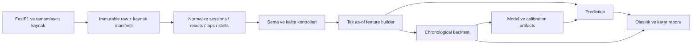

# F1 modelini araştırma ve mülakat düzeyine taşıma planı

Durum: önerilen tasarım; implement edilmiş veya performansı ölçülmüş sayılmaz. 15 Eylül 2026 incelemesi. Başlangıç bulguları [tam kod auditinde](F1_CODE_AUDIT.md).

## 1. İlk karar: tam olarak neyi, ne zaman tahmin ediyoruz?

İlk sürümün ana hedefi: **yarış başlamadan önce tanımlı bir UTC kesim anında, bilinen katılımcılar için resmî final classification sıralaması dağılımı**. Her çıktı `forecast_origin`, `available_at`, grid'in provisional/final durumu ve model sürümü taşımalı. Sonradan verilen ceza dahil resmî sonucu hedeflemek ayrı bir belirsizliktir; sonuç revizyon tarihi saklanmalı.

| Ürün | Bilgi kesimi | Girdiler | Çıktı |
|---|---|---|---|
| Öncelik: qualifying sonrası yarış tahmini | Q yayımlandıktan sonra, yarış başlamadan önce seçilen sabit kural | Önceki yarışlar + o ana kadarki practice/Q + mevcut grid duyurusu | Win/podium/top-k, expected rank, sıra dağılımı |
| İkinci: hafta sonu öncesi | İlk antrenmandan önce | Önceki etkinlikler + entry list + pist | Ayrı model ve ayrı leaderboard |
| Sonraki: yarış içi güncelleme | Tur sonu ve veri yayın gecikmesi | Yalnız o ana kadar timing/stint/track status | Koşullu kalan yarış dağılımı |
| Ayrı ürün: strateji senaryosu | Belirlenmiş tur | Mevcut durum + açık varsayımlar | Pit zamanının koşullu etkisi; garanti optimum iddiası yok |

Hafta sonu öncesi modele Q bilgisi verilmez. Yarış sonrası rekonstrüksiyon retrospektif analiz olarak etiketlenir. Tarihsel kaynakların yayın zamanı bilinmiyorsa “strict point-in-time backtest” değil “event-cutoff retrospective backtest” denir; bu fark raporda görünür kalır.

## 2. Katmanlı mimari ve veri sözleşmesi

Önerilen modüller: `domain/`, `providers/`, `storage/`, `quality/`, `features/`, `models/`, `evaluation/`, `simulation/`, `reporting/`, `cli/`. Ayrı servis/mikroservis gerekmiyor; test edilebilir Python paketi yeterli. Modül ayrımı davranış sözleşmesiyle yapılmalı; eski 594 satırı dosyalara bölmek tek başına dönüşüm değildir.

Temel tablolar:

- `events`: kalıcı event ID, sezon/round, pist/layout ID, session türü, UTC başlangıç/son, format.
- `entries`: event/driver/team ID, o tarihteki ad, katılım durumu; takım lineage ile sezon kimliği ayrı.
- `results`: grid, final position, classified status, laps completed, points, result revision timestamp.
- `laps`: session/driver/lap ID, lap/sector time, tyre compound/age, stint, pit in/out, track status, accuracy/deleted flags.
- `telemetry_samples`: timestamp, kanal/birim, kaynak, interpolated flag; yalnız ihtiyaç duyulan session partitionları.
- `features`: event/driver/origin/schema version ve hangi geçmiş partitionlardan üretildiği.
- `manifest`: source URL, retrieved_at, available_at biliniyorsa, content hash, provider sürümü, kapsam/eksiklik, kullanım koşulu notu.

Raw snapshotlar değişmez; düzeltme yeni sürüm olur. Küçük public fixture'lar ve deterministik offline örnekler Git'e, büyük cache yerel/data storage'a gider. Model artifact: preprocessing + feature schema + model + calibration + train cutoff + config/hash.

## 3. Model geliştirme sırası

### M0 — Dürüst referanslar ve değerlendirme

Uniform win (`1/N`), grid sıralaması, geçmiş form ve düzenlileştirilmiş yarış içi softmax referansları. Grid sırasının olasılığa dönüştürüldüğü temperature varsa yalnız geçmiş validation'dan seçilir. Her model aynı entry list ve forecast origin ile değerlendirilir. Referans model bile tüm olasılık/top-k tutarlılık kontrollerinden geçer.

### M1 — Tutarlı olasılıksal ranking

Önce düzenlileştirilmiş, yorumlanabilir Plackett–Luce aday modeli: sürücü fayda skoru `s_i=f(x_i)`, sıradaki sürücü seçimi kalan yarışçılar üzerinde `exp(s_i)/sum(exp(s_j))`. Tam sıralama olasılığı bu ardışık seçimlerin çarpımıdır. Böylece winner toplamı 1 olur; aynı ortak dağılımdan simüle edilen sıralamalar podium/top-k ve expected rank sağlar. [Model yazarlarının PlackettLuce açıklaması](https://hturner.github.io/PlackettLuce/articles/Overview.html)

Özellikler: grid/Q bölüm içi göreli hız; geçmiş pace/form; driver/team kısmi havuzlama; pist tipi; deneyim; kural dönemi; missing indicators. Doğrusal skorla başla, boosting skorunu aynı dış backtest'te challenger olarak dene. Bağımsız pairwise skorları doğrudan “kazanma olasılığı” diye göstermemeli. PL'nin kalan alternatiflerden bağımsızlık varsayımı takım/yarış korelasyonunu tam temsil etmez; limit model card'a yazılır.

### M2 — Pace ve yarış dışı kalmayı ayırma

Lap verisi coverage doğrulanınca clean-lap pace modeli + ayrı completion/hazard modeli. Clean laps: pit in/out, SC/VSC, kırmızı bayrak, deleted/inaccurate ve trafik etkilerini işaretle; filtrelenmiş veri oranını raporla. Robust/hierarchical pace regresyonu tyre age, compound, stint, track evolution ve sürücü/takım etkileriyle başlar. Yakıt miktarı gözlenmiyorsa ölçülmüş özellik gibi sunulmaz; lap index etkisi yakıt ile pist değişimini karıştırabilir.

Retirement etiketi completed lap ve status ile tanımlanır; DNS/DSQ ayrı süreçtir. Ortak yarış şoku ve takım bağımlılığı için senaryolar gerekir. Pace + retirement simülatörünün classification kuralları doğrulanmadan M1 yerine üretime alınmaz. Ayrık risk modeli, DNF sayısı yeterli değilse güçlü prior ve belirsizlik aralığıyla sınırlanır.

### M3 — Telemetri ve strateji

Public kanallardan hız dağılımı, throttle/brake oranları, seçili segmentlerde göreli hız, stint tutarlılığı aday özetlerdir. Yüksek frekanslı çok sayıda örnek çok sayıda bağımsız yarış demek değildir. Tüm turları ayrı train/test'e rastgele dağıtmak yasak: etkinlik aynı fold'da kalır. Practice long-run bilgisi post-Q modeli için kullanılabilir; hedef yarışın gelecekteki turları kullanılamaz.

Telemetri interpolasyonu ve kanal birleşimi yeni ölçüm üretmez. FastF1'ın birincil kodu bilinen kanallara farklı interpolasyon yöntemleri uyguladığını gösteriyor; orijinal zamanlar, örnek aralığı ve yeniden örnekleme yöntemi saklanmalı. Kamusal kanallar ekiplerin bütün sensör sistemine eşdeğer kabul edilmez. [FastF1 kaynak kodu](https://github.com/theOehrly/Fast-F1/blob/main/fastf1/core.py)

Strateji, pit loss + lastik degradation + trafik + SC olasılığıyla Monte Carlo senaryo karşılaştırmasıdır. Önce tur zamanı/pit loss modelini holdout'ta doğrula; sonra “tur 18 veya 22 pit” gibi duyarlılık analizi ekle. Policy evaluation seçilim yanlılığı taşır: tarihsel iyi pit sonucu, başka zamanda da iyi olacağını kanıtlamaz. TUM araştırma grubunun simülatörü modüler yarış/strateji yaklaşımı için araştırma referansıdır; doğrudan kod kopyalamadan önce lisans ve varsayımlar incelenir. [TUM race-simulation](https://github.com/TUMFTM/race-simulation)

## 4. Ücretsiz veri araştırmasının modele etkisi

FastF1 timing, sonuç, schedule ve telemetry erişimi ile cache sağlar; Jolpica uyumlu tarihsel API desteği vardır. İlk adım her sezon/session için coverage manifesti oluşturmaktır; bir kütüphanenin bir kanalı desteklemesi bütün yarışlarda o kanalın bulunduğu anlamına gelmez. [FastF1 resmi repository](https://github.com/theOehrly/Fast-F1)

Kaynak erişiminin ücretsiz olması yeniden dağıtım lisansı değildir; indirici, kaynak bağlantısı ve küçük izinli fixture tercih edilmeli. Telemetri indirmesi sonuç tablosu smoke test'inden sonra kademeli yapılır. Hava tahmin arşivi yoksa yarışın gerçek havası sadece retrospektif analizde kullanılır. Sahip olunmayan lastik yüzey sıcaklığı, yakıt yükü, setup veya ekip içi telemetry tasarıma zorunlu girdi yapılmaz.

Open-Meteo Historical Forecast, farklı model koşularının ilk saatlerini birleştirir; tek başına cumartesi günü pazar için bilinen tahmini yeniden kurmaz. `Single Runs` kullanılırsa model initialization ve gerçek availability tahmin kesiminden önce olmalı; bu zamanlar/lead saklanmalı. Sonradan oluşmuş reanalysis veya forecast-origin sonrası koşu predictive feature olamaz. [Historical Forecast açıklaması](https://open-meteo.com/en/docs/historical-forecast-api), [Single Runs API](https://open-meteo.com/en/docs/single-runs-api)

İlk post-Q benchmark'ta ana başlangıç özelliği qualifying position olmalı. Gerçek yarış grid'i yalnız tahmin anında yayımlandığını kanıtlayan arşiv varsa kullanılır; güncel sonuç API'sindeki nihai grid'i geçmiş post-Q anına taşımak yasaktır. Nihai grid kullanan retrospektif deney varsa ayrı isim ve leaderboard taşır.

## 5. Backtest: modelden daha önemli sözleşme

1. Etkinlikleri gerçek UTC zamanına göre sırala. Tüm sürücüler, turlar ve sessionlar aynı etkinlik grubunda tutulur.
2. Her dış test etkinliği için geçmiş veriyle features/preprocessing/model üret. Gelecekteki satır eklemek eski tahmini değiştirmemeli.
3. Geçmiş bloğun içinde tuning ve calibration için ayrı ileri yürüyen bloklar ayır; en yeni dış test bloğu hiç seçim için kullanılmaz.
4. Genel `TimeSeriesSplit` fikri uygundur ama düzensiz F1 takvimi ve çok satırlı etkinlikler için doğrudan satıra uygulamak yeterli değildir; event split indekslerini özel üret. [Resmi TimeSeriesSplit belgesi](https://scikit-learn.org/stable/modules/generated/sklearn.model_selection.TimeSeriesSplit.html)
5. Win için yarış başına log loss ve multiclass Brier; ranking için yarış başına MAE/Kendall ve top-k; completion için ayrı proper scores. Kalibrasyon grafiği bin sayıları ve aralıklarıyla sunulur. Brier tek başına saf calibration ölçüsü değildir. [Resmi calibration rehberi](https://scikit-learn.org/stable/modules/calibration.html)
6. Belirsizliği sürücü satırı değil etkinlik/blok bootstrap ile hesapla; sezon ve düzenleme dönemi kırılımları göster. Sınırlı yarış sayısında aralıklar genişse sonuç “kararsız” kalır.
7. Her feature ailesine ablation: grid, historical form, practice pace, telemetry. İyileşme göstermeyen karmaşıklık modelden çıkarılır veya deney olarak kalır.

Kalibrasyon için küçük geçmiş bloklarda sigmoid/tek temperature öncelikli aday; isotonic yalnız geçmiş deney kanıtıyla seçilir. Sürücüye özel binary calibration sonrası olasılıkları normalize etmek calibration garantisi sağlamaz; ortak yarış dağılımını geçmiş blokta kalibre et ve tekrar ölç.

## 6. Aşamalar ve kabul kapıları

| Aşama | Somut teslim | Geçiş koşulu |
|---|---|---|
| A: veri ve domain | Provider, schema, manifest, coverage raporu | Event/driver anahtarları tekil; hedef ve sonraki sonuç girişi sıfır; hata sessiz veri kaybına dönüşmüyor |
| B: ortak features | Tek as-of builder ve fixture testleri | Gelecek sonuç mutasyonu geçmiş features'ı değiştirmiyor; aynı yarış satır sırası değişimi takım features'ını değiştirmiyor; train/inference parity |
| C: benchmark | M0, immutable dış fold tahminleri, metric raporu | Yarışlar train/test'te kesişmiyor; fit artifacts yalnız train; sonuçlar yeniden üretilebilir |
| D: ranking | M1 + calibration + model card | Olasılıklar finite ve [0,1]; win toplamı 1; top-k toplamı k; rank desteği 1..N; sabit seed tekrarlanabilir |
| E: challenger seçimi | Referans/M1/M2 karşılaştırması ve ablation | Önceden seçilen ana metrikte paired etkinlik farkı ve belirsizlik raporu; kazanç yoksa model deneysel kalır |
| F: telemetry/strategy | Veri kalite paneli, pace holdout, senaryo raporu | Ek özelliğin dış blok katkısı ve veri maliyeti görünür; fiziksel varsayımlar açık; counterfactual başarı iddiası yok |
| G: sunum | Tek komut offline demo, rapor, CI | Temiz ortamda kurulum; ağsız demo; README komutları çalışıyor; UI mevcut artifact ile aynı değerleri gösteriyor |

Testler: sprint formatı, yağmurlu Q, grid cezası/pit lane start, rookie, yeni takım, boş Q, incomplete result, aynı event teammate, null status, sonuç revizyonu, sezon sonu. Test önceliği gerçek hata sınıflarıdır; her fonksiyon için yüzeysel test yazmak hedef değildir.

Başarı eşiği için tahmini “%90 accuracy” sözü verilmez. Champion seçimi için ana metrik ve kabul edilebilir secondary trade-off değerlendirmeden önce config'e yazılır; paired belirsizlik aralığı ikna etmiyorsa üstünlük iddiası kurulmaz. Teknik doğruluk kabul kapıları performans kazanımından bağımsız zorunludur.

## 7. Görüntülenebilir ve anlaşılır sunum

Dört sade görünüm yeterli:

- **Race forecast:** yarış/origin seçimi, coverage durumu, win/podium yüzdeleri, sıra dağılımı; belirsizlik görünür.
- **Model evidence:** ileri yürüyen leaderboard, calibration, sezon kırılımı, baseline farkı, ablation; deneme ve yayımlanmış model ayrımı.
- **Pace explorer:** temiz/çıkarılmış tur ayrımı, compound/stint, telemetri örnekleme bilgisi; “bu veri neden dışlandı?” detayı.
- **Strategy lab:** pit-lap ve koşul senaryoları, dağılım karşılaştırması, varsayımlar. Tahmin ekranıyla karıştırılmaz.

Mülakat anlatısı: problemi ve bilgi kesimini tanımladım → sızıntıları yakalayan testleri kurdum → baselineları aştığımı ya da aşamadığımı dürüstçe ölçtüm → karmaşıklığı ablation ile gerekçelendirdim → modelin yanıldığı yarışları açıkladım → aynı sonucu yeniden üretebildim. Teknik emek bu kanıt zincirinde görünür.
